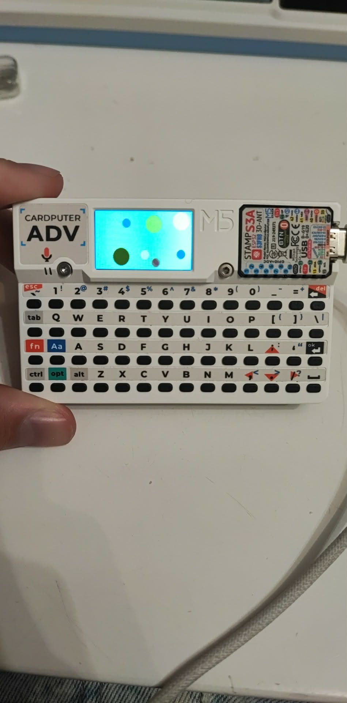

# Simple collision simulation for M5Stack Cardputer and M5Stack Cardputer ADV

## Controls

`b` - add a ball to the enviroment

`x`- remove a ball from the enviroment

`f`- reset velocities

`h` - add friction to the system

`a` - make the balls smaller

`d` - make the balls bigger
